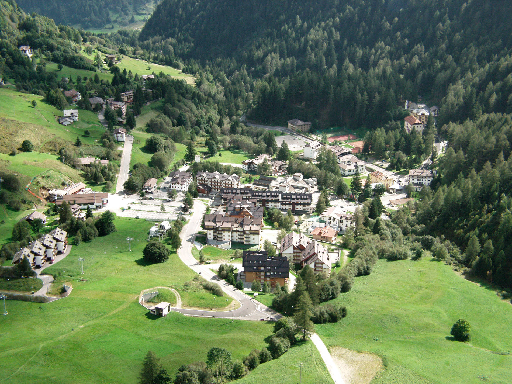

# ParallaxSlider

Simple Slider for background images with parallax effect

## Tutorial

Include files JS and CSS <br>
```html
    <link type="text/css" rel="Stylesheet" href="parallax.slider.css" />
    <script src="parallax.slider.js"></script>
```
Call the script on class ".parallax-slider"

```html
    <script type="text/javascript">
    	$( document ).ready(function() {
    		$(".parallax-slider").parallaxSlider({
    			// Optional parameter
                // Default:
                // speedSlide : 5000
                // speedParallax : 0.5
                // description : true
                speedSlide : 5000,
                speedParallax : 0.50,
                description : true
    		});
    	});
    </script><br>
```

Include your parallax slider in a contanier

```html
    <div class="container-slider">
		<div class="parallax-slider">
			
			
		</div>
	</div>
```
Where css of the container is something like
```css
    .container-slider{
    	width: 100%;
    	height: 600px;
    	position: relative;
    	margin: 0;
    }
```
